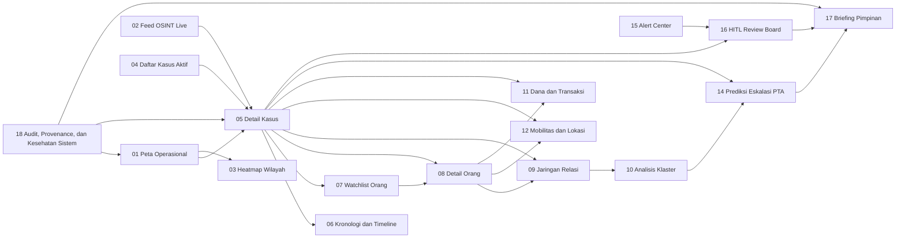

# UIX

## Master Plan Command Center

Status dokumen: rancangan produk dan pengalaman pengguna.

Status implementasi: belum dibangun.

Status prioritas: tinggi.

Target utama: ruang komando internal.

Jumlah operator utama: 8 orang.

Jumlah halaman utama: 18 halaman.

Mode visual utama: gelap operasional.

Aksen brand utama: oranye yang ditahan, bukan neon.

Karakter visual: teknologi maju, tenang, tegas, tidak berlebihan.

Karakter pengalaman: cepat dibaca, cepat dipindah, cepat dihubungkan.

Karakter kerja: layar penuh, chart-heavy, map-heavy, graph-heavy.

Karakter keputusan: melihat kasus, melihat orang, melihat jaringan, melihat prediksi, lalu memutuskan.

Dokumen ini sengaja panjang.

Dokumen ini memang dimaksudkan untuk menjadi pijakan utama desain produk.

Dokumen ini bukan kumpulan ide acak.

Dokumen ini adalah peta keputusan.

Dokumen ini harus cukup matang untuk dipakai tim desain, tim frontend, tim backend, tim analis, dan pimpinan produk.

Dokumen ini menempatkan UIX sebagai command center.

UIX bukan sekadar dashboard.

UIX bukan sekadar peta.

UIX bukan sekadar kumpulan tabel.

UIX adalah ruang kerja bersama yang menyatukan berita, kasus, orang, lokasi, jaringan, prediksi, persetujuan, dan briefing.

UIX harus terasa seperti pusat kontrol yang hidup.

UIX tidak boleh terasa seperti admin panel yang dibesarkan.

UIX tidak boleh terasa seperti web kantor biasa.

UIX tidak boleh tenggelam dalam ornament futuristik yang melelahkan.

UIX harus serius.

UIX harus tajam.

UIX harus terasa mahal tanpa terlihat pamer.

UIX harus membantu delapan operator bekerja pada konteks yang sama tanpa harus membuka puluhan jendela terpisah.

UIX harus membuat satu kasus bisa ditarik dari peta ke orang, dari orang ke jaringan, dari jaringan ke prediksi, dari prediksi ke keputusan.

UIX harus membuat hubungan antarhalaman terasa alami.

UIX harus membuat operator selalu tahu:

- apa yang baru terjadi,
- siapa yang terlibat,
- siapa yang perlu diperiksa,
- jaringan mana yang berubah,
- lokasi mana yang memanas,
- rekomendasi mana yang perlu ditindak,
- dan keputusan mana yang sedang menunggu manusia.

---

## 1. Tujuan Produk

UIX dibangun sebagai command center visual untuk orkestrasi intelijen berbasis data uji internal.

UIX harus mengubah aliran data yang tersebar menjadi ruang kerja yang bisa dipahami dalam hitungan detik.

UIX harus menempatkan peta sebagai pintu masuk utama.

UIX harus menempatkan kasus sebagai objek operasional utama.

UIX harus menempatkan orang sebagai objek investigasi utama.

UIX harus menempatkan jaringan sebagai konteks hubungan utama.

UIX harus menempatkan prediksi sebagai konteks keputusan berikutnya.

UIX harus menempatkan HITL sebagai pagar utama sebelum keputusan final.

UIX harus bisa dipakai pada mode tenang.

UIX harus juga bisa dipakai pada mode ramai.

UIX harus tetap terbaca saat banyak alert masuk.

UIX harus tetap tenang saat hanya sedikit kejadian baru.

UIX harus memprioritaskan kejelasan visual dibanding kepadatan tulisan.

UIX harus memprioritaskan grafik, peta, dan hubungan.

UIX harus meminimalkan scrolling panjang pada layar operasional utama.

UIX harus membuat operator bisa bekerja dengan layar penuh.

UIX harus bisa dipakai pada monitor standar.

UIX harus tetap terasa tepat pada layar 4K.

UIX harus bisa menampilkan satu kasus dalam mode fokus.

UIX juga harus bisa menampilkan banyak kasus dalam mode situasional.

UIX harus membantu operator menjawab lima pertanyaan inti:

1. Kasus mana yang paling perlu dilihat sekarang.
2. Orang mana yang paling penting untuk diprioritaskan.
3. Jaringan mana yang sedang berubah.
4. Lokasi mana yang menjadi pusat panas.
5. Keputusan mana yang harus melewati manusia.

---

## 2. Prinsip Produk

### 2.1 Peta dulu, detail kemudian

Halaman utama wajib berupa peta nasional dengan heatmap kejadian terbaru.

Operator harus bisa merasakan situasi hanya dengan melihat peta.

Peta bukan dekorasi.

Peta adalah pintu masuk.

Peta harus menunjukkan pola, bukan sekadar titik.

Heatmap harus bersifat temporal.

Heatmap harus dapat difilter.

Heatmap harus dapat diklik.

Heatmap harus bisa turun ke daftar kasus.

Heatmap harus bisa turun ke detail kasus.

Heatmap harus bisa bertaut ke orang dan jaringan.

### 2.2 Satu objek, banyak pintu masuk

Setiap kasus harus bisa dibuka dari peta.

Setiap kasus harus bisa dibuka dari feed.

Setiap kasus harus bisa dibuka dari alert.

Setiap kasus harus bisa dibuka dari halaman orang.

Setiap orang harus bisa dibuka dari kasus.

Setiap orang harus bisa dibuka dari watchlist.

Setiap orang harus bisa dibuka dari jaringan.

Setiap jaringan harus bisa dibuka dari kasus.

Setiap prediksi harus bisa dibuka dari kasus.

Setiap briefing harus bisa dibuka dari kasus.

Ini berarti UIX harus memegang konsep objek inti yang konsisten.

Objek inti itu adalah:

- kasus,
- orang,
- lokasi,
- jaringan,
- alert,
- prediksi,
- briefing,
- dan bukti.

### 2.3 Grafik lebih penting daripada ornamen

UIX lebih suka chart yang jelas daripada card yang ramai.

UIX lebih suka peta yang tajam daripada ilustrasi berlebihan.

UIX lebih suka graf relasi yang terbaca daripada animasi yang indah tetapi tidak berguna.

UIX lebih suka highlight yang hemat daripada glow di semua tempat.

UIX lebih suka gerakan kecil yang membantu orientasi daripada animasi futuristik berlebihan.

### 2.4 Gelap, tetapi tidak cyberpunk murahan

Tema utama harus gelap karena ruang komando akan sering dipakai lama dan penuh layar.

Tema gelap harus memakai panel berlapis, bukan hitam total.

Tema gelap harus memakai aksen oranye brand secara hemat.

Tema gelap boleh memakai biru dingin dan hijau data.

Tema gelap tidak boleh tenggelam dalam ungu, neon, atau efek kaca yang berlebihan.

Tema gelap harus terasa fungsional.

Tema gelap harus terasa terpercaya.

Tema gelap harus tetap nyaman dipakai dalam sesi panjang.

### 2.5 Semua halaman harus saling mengunci

Tidak boleh ada halaman yang terasa yatim.

Tidak boleh ada halaman yang hidup sendiri.

Tidak boleh ada halaman yang hanya menampilkan data tanpa membuka pintu ke konteks lain.

Setiap halaman harus tahu:

- datang dari mana,
- untuk menjawab apa,
- dan sesudah ini operator perlu pergi ke mana.

### 2.6 Delapan operator, satu konteks

Setiap operator memegang fokus yang berbeda.

Tetapi semua operator harus bisa berbicara tentang objek yang sama.

Jika operator peta memilih satu kasus, operator jaringan harus bisa membuka kasus yang sama.

Jika operator jaringan menemukan broker penting, operator watchlist harus bisa langsung membuka orang itu.

Jika operator prediksi menandai eskalasi tinggi, operator HITL harus menerima konteks yang sama.

Ini berarti UIX harus dirancang sebagai command center yang terhubung, bukan koleksi layar terpisah.

---

## 3. Model Operasional Delapan Orang

UIX diasumsikan dipakai oleh delapan operator aktif.

Mereka tidak semuanya melihat layar yang sama.

Mereka tidak semuanya melakukan pekerjaan yang sama.

Mereka juga tidak semuanya berada pada level keputusan yang sama.

Peran delapan operator yang direkomendasikan adalah sebagai berikut.

### 3.1 Operator 1 — Komandan Peta

Fokus utama: situasi nasional.

Layar utama: peta operasional.

Pertanyaan utama: di mana titik panas yang paling baru dan paling penting.

Tanggung jawab: mengarahkan perhatian tim.

### 3.2 Operator 2 — Operator Feed OSINT

Fokus utama: aliran berita dan kejadian baru.

Layar utama: feed OSINT dan triase cepat.

Pertanyaan utama: berita mana yang baru masuk dan apakah mengubah situasi.

Tanggung jawab: memastikan tidak ada kasus penting yang lolos dari pandangan.

### 3.3 Operator 3 — Operator Kasus

Fokus utama: daftar kasus aktif dan kronologi.

Layar utama: case registry dan detail kasus.

Pertanyaan utama: kasus mana yang perlu naik prioritas dan bukti apa yang masih kurang.

Tanggung jawab: menjaga narasi kasus tetap utuh.

### 3.4 Operator 4 — Operator Identitas dan Watchlist

Fokus utama: orang, profil, alias, dan kecocokan watchlist.

Layar utama: watchlist dan detail orang.

Pertanyaan utama: siapa yang muncul, siapa yang cocok, dan seberapa kuat kecocokannya.

Tanggung jawab: menjaga kualitas identifikasi orang.

### 3.5 Operator 5 — Operator Jaringan

Fokus utama: relasi, broker, cluster, dan struktur sel.

Layar utama: network graph dan cluster analysis.

Pertanyaan utama: siapa terhubung ke siapa, siapa penghubung, dan cluster mana yang berubah.

Tanggung jawab: memaknai struktur jaringan.

### 3.6 Operator 6 — Operator Logistik dan Dana

Fokus utama: transaksi, pergerakan, lokasi, dan pola dukungan.

Layar utama: dana dan mobilitas.

Pertanyaan utama: aliran dukungan bergerak ke mana dan siapa yang menghubungkan titik-titik itu.

Tanggung jawab: melihat pola logistik yang tidak tampak di halaman lain.

### 3.7 Operator 7 — Operator Prediksi

Fokus utama: PTA, kecenderungan, dan rekomendasi.

Layar utama: forecast desk.

Pertanyaan utama: apa yang berpotensi terjadi berikutnya dan seberapa yakin sistem.

Tanggung jawab: menerjemahkan prediksi menjadi konteks keputusan.

### 3.8 Operator 8 — Operator Review dan Briefing

Fokus utama: HITL, approval, dan briefing.

Layar utama: review board dan executive briefing.

Pertanyaan utama: mana yang perlu disetujui, mana yang perlu ditunda, dan apa yang harus dikirim ke pimpinan.

Tanggung jawab: mengubah analisis menjadi keputusan yang rapi dan aman.

---

## 4. Matriks Layar Delapan Operator

| Operator | Peran | Layar utama | Layar cadangan | Keputusan yang dipegang |
|---|---|---|---|---|
| 1 | Komandan Peta | Peta Operasional | Heatmap Wilayah | Arah fokus tim |
| 2 | Feed OSINT | Feed OSINT | Alert Center | Apa yang baru dan layak naik |
| 3 | Operator Kasus | Daftar Kasus | Detail Kasus | Prioritas kasus |
| 4 | Watchlist | Watchlist Orang | Detail Orang | Identifikasi orang |
| 5 | Jaringan | Network Graph | Cluster Analysis | Struktur jaringan |
| 6 | Logistik dan Dana | Dana dan Transaksi | Mobilitas dan Lokasi | Pola dukungan |
| 7 | Prediksi | Prediksi PTA | Timeline Operasional | Risiko berikutnya |
| 8 | Review dan Briefing | HITL Review | Briefing Pimpinan | Persetujuan dan narasi final |

UIX harus mendukung mode di mana setiap operator langsung masuk ke layar utama perannya.

UIX juga harus mendukung mode di mana semua operator bisa pindah cepat ke halaman lain.

UIX harus menyediakan preset layout per operator.

UIX harus menyediakan preset layout per shift.

UIX harus menyediakan preset layout per skenario.

UIX harus menyediakan mode darurat ketika satu kasus besar mendominasi.

Pada mode darurat, banyak layar bisa otomatis terikat ke kasus yang sama.

Pada mode normal, layar boleh bergerak lebih bebas.

---

## 5. Tiga Skenario Kasus Uji Yang Harus Didukung UI

Dataset uji saat ini memiliki tiga kasus inti.

Ketiga kasus ini harus menjadi dasar pembuktian desain UI.

Ketiganya harus terlihat berbeda.

Ketiganya tidak boleh berakhir dengan halaman yang tampil seragam.

### 5.1 Kasus A — Kebakaran Gudang

Nama kasus: `kasus-kebakaran-gudang`.

Tipe kasus: kebakaran gudang dengan indikasi sabotase terkoordinasi.

Halaman yang harus paling kuat untuk kasus ini:

- peta operasional,
- detail kasus,
- timeline operasional,
- mobilitas dan lokasi,
- jaringan relasi,
- dan forecast eskalasi.

Kasus ini harus terasa spasial.

Kasus ini harus terasa lokasional.

Kasus ini harus terasa seperti ada jejak pergerakan dan keterhubungan.

### 5.2 Kasus B — Pendanaan Mencurigakan

Nama kasus: `kasus-pendanaan-mencurigakan`.

Tipe kasus: koordinasi finansial.

Halaman yang harus paling kuat untuk kasus ini:

- dana dan transaksi,
- watchlist orang,
- detail orang,
- jaringan relasi,
- cluster analysis,
- dan forecast PTA.

Kasus ini harus terasa transaksional.

Kasus ini harus terasa relasional.

Kasus ini harus terasa seperti pola yang muncul dari banyak pergerakan kecil.

### 5.3 Kasus C — Propaganda Burst

Nama kasus: `kasus-propaganda-burst`.

Tipe kasus: amplifikasi narasi terkoordinasi.

Halaman yang harus paling kuat untuk kasus ini:

- feed OSINT,
- narasi dan propaganda,
- watchlist orang,
- jaringan relasi,
- cluster analysis,
- dan briefing pimpinan.

Kasus ini harus terasa naratif.

Kasus ini harus terasa seperti ledakan sinkron.

Kasus ini harus terasa seperti pola kampanye, bukan sekadar satu peristiwa.

### 5.4 Aturan penting dari tiga kasus uji

Ketiga kasus harus bisa dimulai dari peta.

Ketiga kasus harus bisa dibuka dari daftar kasus.

Ketiga kasus harus bisa dihubungkan ke orang.

Ketiga kasus harus bisa dihubungkan ke jaringan.

Ketiga kasus harus bisa berujung ke briefing.

---

## 6. Arsitektur Informasi Tingkat Produk

UIX harus dibangun di atas objek utama, bukan halaman utama.

Halaman hanyalah pintu.

Objek adalah inti.

Objek utama UIX adalah:

### 6.1 Kasus

Kasus adalah pusat cerita.

Kasus harus punya identitas yang jelas.

Kasus harus punya lokasi.

Kasus harus punya waktu.

Kasus harus punya orang terkait.

Kasus harus punya jaringan terkait.

Kasus harus punya status.

Kasus harus punya tingkat risiko.

Kasus harus punya jalur ke briefing.

### 6.2 Orang

Orang adalah pusat investigasi identitas.

Orang bisa muncul dari berita.

Orang bisa muncul dari watchlist.

Orang bisa muncul dari grafik relasi.

Orang bisa muncul dari transaksi.

Orang harus selalu punya halaman detail yang sama.

Halaman orang harus selalu menghubungkan identitas ke lokasi, akun, transaksi, jaringan, dan kasus.

### 6.3 Lokasi

Lokasi adalah konteks ruang.

Lokasi harus terlihat di peta.

Lokasi harus bisa mengumpulkan kasus.

Lokasi harus bisa mengumpulkan orang.

Lokasi harus bisa mengumpulkan jejak pergerakan.

### 6.4 Jaringan

Jaringan adalah konteks hubungan.

Jaringan harus memetakan relasi.

Jaringan harus menonjolkan broker.

Jaringan harus menonjolkan cluster.

Jaringan harus menonjolkan perubahan struktur.

### 6.5 Alert

Alert adalah pemanggil perhatian.

Alert tidak boleh menjadi halaman buntu.

Alert harus selalu membawa operator ke objek inti.

### 6.6 Prediksi

Prediksi adalah lapisan masa depan.

Prediksi tidak boleh berdiri sendirian.

Prediksi harus selalu menaut ke kasus, orang, dan jaringan yang mendasarinya.

### 6.7 Briefing

Briefing adalah keluaran akhir.

Briefing harus menyusun hasil dari semua lapisan sebelumnya.

Briefing harus mudah dibaca.

Briefing harus tetap terasa terkait dengan data aslinya.

### 6.8 Bukti

Bukti adalah pengikat kepercayaan.

Bukti harus selalu bisa dilihat.

Bukti harus selalu bisa dibuka.

Bukti harus selalu punya konteks.

---

## 7. Pola Navigasi Utama

UIX harus memakai navigasi yang terasa seperti pusat operasi.

Navigasi tidak boleh memakan terlalu banyak ruang.

Navigasi tidak boleh terlihat seperti sidebar admin biasa.

UIX direkomendasikan memakai tiga lapis navigasi.

### 7.1 Lapis pertama — mode global

Mode global adalah pemilihan area besar:

- Operasi,
- Investigasi,
- Prediksi,
- Review,
- dan Sistem.

Mode global membantu orientasi.

Mode global mengurangi rasa tersesat.

### 7.2 Lapis kedua — halaman kerja

Setelah mode global dipilih, operator melihat daftar halaman yang relevan untuk mode itu.

Contohnya:

- Operasi berisi peta, feed, kasus, timeline, lokasi.
- Investigasi berisi orang, watchlist, jaringan, dana, narasi.
- Prediksi berisi forecast, cluster, perubahan, rekomendasi.
- Review berisi alert center, HITL, briefing, arsip.
- Sistem berisi audit, provenance, dan kesehatan sistem.

### 7.3 Lapis ketiga — panel konteks

Setelah operator masuk ke halaman, konteks objek harus terus ditempelkan di layar.

Artinya, jika operator sedang fokus pada satu kasus:

- nama kasus harus selalu terlihat,
- status risiko harus selalu terlihat,
- lokasi harus selalu terlihat,
- orang kunci harus selalu terlihat,
- dan jalur ke halaman berikutnya harus selalu dekat.

### 7.4 Command palette

UIX perlu command palette.

Command palette berguna untuk lompatan cepat.

Command palette berguna untuk operator yang tidak ingin terus menelusuri navigasi.

Command palette harus bisa membuka:

- kasus,
- orang,
- lokasi,
- alert,
- briefing,
- dan halaman sistem.

### 7.5 Breadcrumb yang benar

Breadcrumb di UIX bukan dekorasi.

Breadcrumb harus memberitahu hubungan konteks.

Contoh hubungan yang bagus:

Peta Operasional -> Kasus Aktif -> Detail Kasus -> Orang Kunci -> Jaringan Relasi.

Breadcrumb seperti ini mengingatkan operator bahwa objek-objek itu saling terhubung.

---

## 8. Inventaris Halaman

UIX direkomendasikan memiliki 18 halaman utama.

Jumlah ini lebih dari cukup untuk command center delapan operator.

Jumlah ini juga masih cukup terkontrol.

Daftar halamannya adalah sebagai berikut.

| Kode | Nama Halaman | Peran utama | Jenis tampilan |
|---|---|---|---|
| 01 | Peta Operasional Nasional | Situational awareness | Peta penuh |
| 02 | Feed OSINT Live | Ingest dan triase | Feed dan chart |
| 03 | Heatmap Wilayah | Konsentrasi kejadian | Peta dan density |
| 04 | Daftar Kasus Aktif | Registri kerja | Tabel dan status |
| 05 | Detail Kasus | Pusat cerita kasus | Split view |
| 06 | Kronologi dan Timeline | Urutan kejadian | Timeline |
| 07 | Watchlist Orang | Prioritas identitas | Grid dan score |
| 08 | Detail Orang | Pusat identitas | Profil dan relasi |
| 09 | Jaringan Relasi | Hubungan antarentitas | Graph |
| 10 | Analisis Klaster | Struktur sel dan broker | Graph dan summary |
| 11 | Dana dan Transaksi | Pola finansial | Sankey dan tabel |
| 12 | Mobilitas dan Lokasi | Jejak ruang | Peta jalur |
| 13 | Narasi dan Propaganda | Amplifikasi dan burst | Chart dan feed |
| 14 | Prediksi Eskalasi PTA | Risiko berikutnya | Forecast desk |
| 15 | Alert Center | Jalur perhatian cepat | Queue dan status |
| 16 | HITL Review Board | Persetujuan manusia | Queue dan compare |
| 17 | Briefing Pimpinan | Narasi ringkas final | Dokumen operasional |
| 18 | Audit, Provenance, dan Kesehatan Sistem | Kepercayaan dan stabilitas | Log dan status |

Halaman utama untuk command center adalah Halaman 01.

Halaman paling sering dibuka setelah itu adalah Halaman 05, 08, 09, 14, 16, dan 17.

Halaman 02 dan 15 harus terasa hidup.

Halaman 17 harus terasa paling tenang.

Halaman 18 harus terasa teknis tetapi tetap bisa dipahami operator non-engineering.

---

## 9. Bahasa Visual Global

### 9.1 Arah umum

UIX harus menggunakan tema gelap operasional.

UIX harus tetap membawa aksen oranye brand.

UIX tidak boleh sepenuhnya hitam.

UIX tidak boleh terlalu abu-abu.

UIX harus punya lapisan.

UIX harus punya kedalaman.

UIX harus punya pemisahan panel yang jelas.

UIX harus menggunakan kontras yang cukup tinggi untuk teks utama.

UIX harus menggunakan kontras yang lebih lembut untuk teks sekunder.

### 9.2 Palet yang direkomendasikan

- latar utama: hampir hitam kebiruan.
- panel dasar: slate sangat gelap.
- panel tinggi: sedikit lebih terang dari panel dasar.
- garis pemisah: biru abu yang tipis.
- aksen utama: oranye brand.
- aksen data: biru dingin.
- aksen sukses: hijau tenang.
- aksen warning: amber tajam.
- aksen bahaya: merah yang tegas.

### 9.3 Perasaan visual yang diinginkan

Serius.

Mahir.

Terkontrol.

Presisi.

Tidak ramai.

Tidak seperti film sci-fi murahan.

Tidak seperti website promosi startup.

Tidak seperti panel admin keuangan.

### 9.4 Apa yang harus dihindari

Latar belakang penuh grid neon.

Glow besar di semua kartu.

Motion tanpa alasan.

Terlalu banyak garis bercahaya.

Terlalu banyak kartu kecil.

Terlalu banyak teks putih murni.

Terlalu banyak ikon dekoratif.

### 9.5 Tipografi

UIX membutuhkan tipografi yang serius dan modern.

Judul harus tegas.

Angka harus mudah dipindai.

Nama orang harus menonjol.

Nama kasus harus lebih menonjol daripada label sistem.

Rekomendasi pasangan tipografi:

- heading: Space Grotesk atau Barlow Condensed.
- body: IBM Plex Sans.
- angka dan kode: IBM Plex Mono atau JetBrains Mono.

### 9.6 Motion

Motion harus digunakan untuk orientasi.

Motion tidak dipakai untuk hiburan.

Motion hanya boleh muncul saat:

- berganti konteks kasus,
- membuka panel detail,
- memperbarui heatmap,
- memindah fokus ke graph,
- atau menandai alert baru.

Motion yang disarankan:

- fade cepat,
- slide pendek,
- scale halus,
- dan highlight temporal yang cepat hilang.

Motion yang harus dihindari:

- bounce,
- elastic berlebihan,
- rotation dekoratif,
- particle animation,
- dan scanning line palsu.

---

## 10. Shell Global Aplikasi

UIX harus memiliki shell global yang sangat konsisten.

Shell global harus membuat semua halaman terasa satu keluarga.

Shell global direkomendasikan berisi:

### 10.1 Bar atas

Bar atas harus menampilkan:

- nama aplikasi,
- mode global,
- filter waktu,
- filter wilayah,
- filter tingkat risiko,
- status sinkronisasi data,
- jumlah alert belum dibaca,
- dan identitas operator aktif.

### 10.2 Rail kiri

Rail kiri harus tipis.

Rail kiri berisi ikon mode besar.

Rail kiri tidak boleh memakan ruang berlebih.

Rail kiri harus bisa disembunyikan.

### 10.3 Area utama

Area utama harus dikuasai visualisasi.

Peta, graph, timeline, dan chart harus menjadi pusat.

Card teks harus menjadi pendukung.

### 10.4 Panel konteks kanan

Panel kanan sangat penting.

Panel kanan adalah tempat ringkasan objek aktif.

Jika operator memilih kasus, panel kanan menampilkan:

- ringkasan kasus,
- status,
- orang kunci,
- alert terkait,
- prediksi,
- dan tombol pindah ke halaman lain.

Jika operator memilih orang, panel kanan menampilkan:

- identitas,
- status watchlist,
- relasi kunci,
- lokasi dominan,
- transaksi utama,
- dan kasus terkait.

### 10.5 Bar bawah

Bar bawah digunakan untuk:

- ticker kejadian,
- status worker,
- mode fullscreen,
- shortcut,
- dan jejak waktu.

Bar bawah tidak selalu tampil penuh.

Pada mode wall atau fullscreen, bar bawah bisa diperkecil.

---

## 11. Relasi Antarhalaman Yang Wajib Ada

Relasi antarhalaman harus eksplisit.

Hubungan wajib yang harus ada adalah:

Peta Operasional -> Detail Kasus.

Peta Operasional -> Heatmap Wilayah.

Feed OSINT -> Detail Kasus.

Daftar Kasus Aktif -> Detail Kasus.

Detail Kasus -> Kronologi dan Timeline.

Detail Kasus -> Watchlist Orang.

Detail Kasus -> Detail Orang.

Detail Kasus -> Jaringan Relasi.

Detail Kasus -> Mobilitas dan Lokasi.

Detail Kasus -> Dana dan Transaksi.

Detail Kasus -> Prediksi Eskalasi PTA.

Detail Kasus -> HITL Review Board.

Watchlist Orang -> Detail Orang.

Detail Orang -> Jaringan Relasi.

Detail Orang -> Mobilitas dan Lokasi.

Detail Orang -> Dana dan Transaksi.

Jaringan Relasi -> Analisis Klaster.

Analisis Klaster -> Prediksi Eskalasi PTA.

Prediksi Eskalasi PTA -> Briefing Pimpinan.

Alert Center -> HITL Review Board.

HITL Review Board -> Briefing Pimpinan.

Briefing Pimpinan -> Detail Kasus.

Audit, Provenance, dan Kesehatan Sistem -> semua halaman lain melalui tautan objek.

---

## 12. Diagram Ringkas Hubungan Antarhalaman

Diagram ini bukan dekorasi.

Diagram ini menunjukkan bahwa halaman-halaman penting tidak berdiri sendiri.

---

## 13. Prinsip Layout

### 13.1 Semua halaman harus punya pusat gravitasi

Halaman peta punya pusat gravitasi di peta.

Halaman graph punya pusat gravitasi di graph.

Halaman prediksi punya pusat gravitasi di forecast chart.

Halaman briefing punya pusat gravitasi di ringkasan narasi.

### 13.2 Semua halaman harus punya jalur tindakan

Halaman tidak boleh hanya menjadi tempat menonton.

Halaman harus membantu operator memutuskan langkah berikutnya.

Langkah berikutnya bisa berupa:

- buka detail,
- pin kasus,
- bandingkan orang,
- teruskan ke review,
- kirim ke briefing,
- atau tandai untuk investigasi lanjutan.

### 13.3 Semua halaman harus punya ringkasan cepat

Operator tidak boleh dipaksa membaca semuanya.

Setiap halaman harus punya area "lihat cepat".

Area ini biasanya berada di panel kanan atau area atas.

### 13.4 Semua halaman harus punya mode penuh

Karena command center dipakai dengan layar besar, tiap halaman harus memiliki mode layar penuh.

Mode layar penuh harus tetap menyimpan konteks.

Mode layar penuh tidak boleh memutus navigasi.

### 13.5 Semua halaman harus punya mode padat

Ada saat di mana operator butuh melihat banyak data sekaligus.

Pada saat itu, UI harus bisa merapat tanpa menjadi tidak terbaca.

---

## 14. Daftar Modul Visual Global

Modul visual yang akan sering dipakai di UIX adalah:

- peta dasar,
- heatmap,
- cluster point,
- panel ringkasan kasus,
- panel ringkasan orang,
- graph jaringan,
- daftar alert,
- daftar watchlist,
- timeline horizontal,
- timeline vertikal,
- sankey transaksi,
- line chart intensitas,
- bar chart distribusi,
- radar risiko,
- tabel operasional,
- panel bukti,
- panel confidence,
- dan kartu briefing.

Modul-modul ini harus terlihat berasal dari satu sistem yang sama.

---

## 15. Pengaturan Nada dan Copy

Bahasa UI harus ringkas.

Bahasa UI harus operasional.

Bahasa UI harus tegas.

Bahasa UI tidak boleh terlalu akademik.

Bahasa UI tidak boleh terlalu santai.

Bahasa UI tidak boleh terlalu penuh jargon teknologi.

Bahasa UI tidak boleh terlalu banyak istilah bahasa Inggris jika ada padanan Indonesia yang jelas.

Label yang disarankan:

- "Kasus Aktif"
- "Orang Terkait"
- "Jaringan Terkait"
- "Tingkat Risiko"
- "Confidence"
- "Bukti Pendukung"
- "Bukti Lemah"
- "Rekomendasi"
- "Perlu Review"
- "Siap Dikirim"
- "Perubahan Struktur"
- "Lonjakan Aktivitas"
- "Lokasi Dominan"
- "Hubungan Utama"

Nada copy untuk alert:

- singkat,
- jelas,
- tidak dramatis,
- tidak hiperbola.

Nada copy untuk briefing:

- formal,
- tajam,
- mudah dipindai,
- dan tetap bisa dilacak ke bukti.

---

## 16. Halaman 01 — Peta Operasional Nasional

Ini adalah halaman paling penting.

Ini adalah layar yang harus terlihat paling dulu ketika command center hidup.

Ini adalah layar yang paling cocok ditempatkan di pusat ruangan.

Halaman ini harus terasa seperti meja orientasi bersama.

Semua operator lain boleh berbeda fokus.

Tetapi semua operator harus bisa kembali ke halaman ini dan langsung mengerti keadaan umum.

Fungsi utamanya adalah menjawab lima pertanyaan dengan sangat cepat:

- kejadian terbaru ada di mana,
- wilayah mana yang memanas,
- kasus mana yang paling butuh perhatian,
- apakah ada perubahan pola dibanding beberapa jam atau hari sebelumnya,
- dan siapa atau apa yang paling menonjol di titik panas tersebut.

Sumber ingest utamanya harus berasal dari berita OSINT yang masuk.

Berita itu harus dipetakan ke wilayah administrasi, koordinat, atau area estimasi.

Jika koordinat presisi belum ada, halaman ini tetap harus bisa bekerja dengan centroid kota atau wilayah.

Peta ini harus menampilkan dua mode utama.

Mode pertama adalah mode kejadian.

Mode kedua adalah mode kepadatan.

Mode kejadian menunjukkan pin, cluster, dan highlight kasus individual.

Mode kepadatan menunjukkan heatmap, intensity field, dan tren panas berdasarkan waktu.

Secara visual, halaman ini harus punya komposisi seperti berikut:

- area tengah sampai kiri besar untuk peta,
- pita informasi atas untuk situasi nasional singkat,
- pita kanan untuk daftar kejadian terbaru,
- bar bawah untuk tren waktu singkat.

Elemen yang harus selalu terlihat:

- jumlah kasus aktif,
- jumlah wilayah panas,
- jumlah alert baru,
- perubahan 24 jam,
- status orkestrasi backend,
- dan tombol cepat ke kasus dominan.

Layer peta yang harus didukung:

- batas administratif,
- titik kasus,
- heatmap kejadian,
- radius kedekatan lokasi sensitif,
- jalur mobilitas jika tersedia,
- area cluster narasi,
- area cluster transaksi,
- dan overlay status cuaca bila nanti berguna untuk korelasi lapangan.

Interaksi utama halaman ini:

- klik titik kasus membuka panel kasus singkat,
- klik wilayah membuka ringkasan wilayah,
- hover cluster menunjukkan komposisi kasus,
- geser rentang waktu mengubah heatmap,
- filter jenis kasus mengubah seluruh layer,
- dan mode "ikuti kasus" mengunci panel kanan pada satu kasus.

Halaman ini harus bisa menjadi pintu masuk ke:

- Detail Kasus,
- Kronologi,
- Watchlist Orang,
- Jaringan Relasi,
- Mobilitas dan Lokasi,
- dan Prediksi Eskalasi.

Halaman ini tidak boleh terlalu penuh teks.

Fokus utamanya adalah ruang, kepadatan, dan intensitas.

Ketika ruang komando sedang tenang, halaman ini tetap harus berguna.

Saat tidak ada ledakan alert, peta harus bergeser dari mode darurat ke mode pemantauan tenang.

Artinya warna tetap hidup, tetapi tidak berteriak.

Saat ada lonjakan signifikan, bar atas dan panel kanan boleh naik intensitas warna.

Namun peta jangan berubah jadi lampu diskotik.

Peta operasional nasional juga harus mendukung mode presentasi.

Dalam mode itu, panel kecil disederhanakan, label diperbesar, dan peta menjadi lebih bersih agar cocok untuk layar besar.

Halaman ini adalah wajah sistem.

Kalau halaman ini buruk, seluruh command center akan terasa lemah.

---

## 17. Halaman 02 — Feed OSINT Live

Halaman ini adalah paru-paru informasi mentah.

Fungsinya bukan untuk membuat keputusan akhir.

Fungsinya adalah untuk melihat apa yang baru masuk, apa yang naik, apa yang aneh, dan apa yang mulai berulang.

Halaman ini harus terasa hidup.

Tetapi tidak boleh terasa seperti timeline media sosial yang berisik.

Feed ini harus disusun dalam tiga kolom konseptual:

- kolom arus masuk,
- kolom triase,
- kolom hasil prioritas.

Kolom arus masuk menampilkan item yang baru diterima.

Kolom triase menampilkan item yang sedang atau baru saja lolos penyaringan awal.

Kolom hasil prioritas menampilkan item yang naik menjadi kasus atau alert.

Setiap kartu feed harus sangat ringkas.

Kartu harus memuat:

- waktu,
- sumber,
- judul singkat,
- lokasi,
- skor relevansi,
- sinyal jenis ancaman,
- kemungkinan entitas orang,
- dan status apakah item itu naik, turun, atau ditahan.

Chart yang cocok untuk halaman ini:

- volume masuk per 5 menit,
- komposisi kategori,
- rasio noise versus relevan,
- lokasi dominan,
- dan daftar kata atau tema yang naik cepat.

Feed tidak boleh sekadar daftar berita.

Feed harus terasa seperti intake desk.

Artinya operator bisa:

- menandai item,
- mengunci item ke kasus,
- mengirim item ke review manual,
- menahan item,
- dan membuat catatan cepat.

Hubungan halaman ini ke halaman lain:

- item yang lolos bisa dibuka ke Detail Kasus,
- item yang menyebut orang watchlist bisa dibuka ke Detail Orang,
- item yang berulang di wilayah yang sama bisa membuka Heatmap Wilayah,
- item yang memicu ancaman tinggi bisa langsung membuka Alert Center.

Halaman ini juga harus punya mode fokus.

Mode fokus dipakai operator ingest untuk melihat hanya satu kategori.

Contoh kategori:

- logistik,
- pendanaan,
- propaganda,
- pergerakan,
- kekerasan,
- dan infrastruktur.

Secara visual, feed tidak boleh memakai terlalu banyak warna acak.

Gunakan satu aksen dominan untuk status naik.

Gunakan satu aksen berbeda untuk status perlu review.

Gunakan merah hanya jika sudah benar-benar menjadi alert.

Halaman ini adalah jembatan antara arus masuk dan analisis.

Jika terlalu mentah, operator lelah.

Jika terlalu disaring, operator kehilangan rasa medan.

Keseimbangan ini harus sangat diperhatikan.

---

## 18. Halaman 03 — Heatmap Wilayah

Halaman ini adalah turunan dari peta utama.

Bedanya, halaman ini tidak berfokus pada satu kasus.

Halaman ini berfokus pada konsentrasi wilayah.

Ketika komandan ruangan bertanya "wilayah mana yang paling menghangat minggu ini", halaman inilah jawabannya.

Peta harus menjadi elemen dominan.

Namun dibanding halaman utama, halaman ini boleh lebih analitis.

Overlay yang dianjurkan:

- kepadatan kejadian,
- kepadatan entitas orang,
- kepadatan pergerakan,
- kepadatan transaksi,
- kepadatan amplifikasi narasi,
- dan perubahan densitas antarperiode.

Panel samping harus menunjukkan:

- peringkat wilayah,
- perbandingan sekarang dengan periode sebelumnya,
- jenis kasus dominan di wilayah,
- orang yang paling sering muncul,
- dan pergeseran wilayah panas.

Chart pendamping yang sangat penting:

- rank bar wilayah,
- mini timeline per wilayah,
- treemap kontribusi jenis kejadian,
- dan indikator kenaikan atau penurunan intensitas.

Halaman ini sangat penting untuk keputusan alokasi perhatian.

Bukan hanya keputusan investigasi.

Dengan halaman ini, operator bisa melihat:

- apakah satu kota terlalu mendominasi,
- apakah kasus tersebar ke banyak titik kecil,
- apakah ada koridor mobilitas,
- atau apakah ada pola merambat.

Heatmap wilayah harus terhubung ke:

- Mobilitas dan Lokasi,
- Detail Kasus,
- Prediksi Eskalasi,
- dan Briefing Pimpinan.

Saat operator mengklik satu wilayah, sistem harus menawarkan tiga jalur:

- buka wilayah sebagai fokus operasi,
- lihat daftar kasus di wilayah,
- atau bandingkan wilayah itu dengan wilayah lain.

Halaman ini cocok untuk layar kedua atau ketiga dalam ruangan.

Ia bekerja sangat baik sebagai pendamping peta utama.

---

## 19. Halaman 04 — Daftar Kasus Aktif

Halaman ini adalah registri kerja.

Kalau peta adalah orientasi, maka daftar kasus adalah disiplin.

Semua kasus yang dianggap aktif harus bisa dilihat di sini.

Ini bukan tabel biasa.

Ini adalah papan kerja operasional.

Kolom yang penting:

- ID kasus,
- nama kasus,
- kategori,
- status,
- tingkat risiko,
- confidence,
- lokasi utama,
- orang dominan,
- perubahan terbaru,
- pemilik penanganan,
- dan waktu pembaruan terakhir.

Tampilan harus mendukung tiga mode:

- tabel padat,
- kartu ringkas,
- dan mode prioritas.

Mode tabel padat cocok untuk operator kasus.

Mode kartu cocok untuk briefing cepat.

Mode prioritas cocok untuk komandan shift.

Penyaringan yang wajib ada:

- berdasarkan tingkat risiko,
- berdasarkan wilayah,
- berdasarkan jenis kasus,
- berdasarkan operator,
- berdasarkan status review,
- dan berdasarkan sumber dominan.

Halaman ini harus terasa seperti ruang kerja inti.

Operator harus bisa menyelesaikan banyak tindakan dari sini tanpa berpindah terlalu jauh.

Tindakan cepat yang harus tersedia:

- buka detail,
- pin kasus,
- kirim ke review,
- minta ringkasan,
- tandai eskalasi,
- tandai tunggu data,
- dan bandingkan dua kasus.

Bagian paling penting dari halaman ini bukan daftar datanya.

Bagian paling penting adalah kemudahan memprioritaskan.

Karena command center akan gagal jika semua kasus tampil sama penting.

Kasus yang baru naik, kasus dengan lonjakan bukti, dan kasus dengan perubahan jaringan harus terlihat menonjol.

Namun kasus lama yang tetap kritis juga tidak boleh tenggelam.

Karena itu, halaman ini harus punya logika visual yang jelas:

- fokus utama untuk kasus baru dan kritis,
- aksen lembut untuk kasus stabil,
- dan status redup untuk kasus observasi panjang.

---

## 20. Halaman 05 — Detail Kasus

Halaman ini adalah pusat cerita.

Semua jalan akhirnya harus bisa bermuara ke sini.

Detail kasus adalah halaman tempat operator memahami satu kasus sebagai objek utuh.

Bukan hanya daftar atribut.

Bukan hanya kumpulan evidence.

Tetapi satu cerita operasional yang bisa dipindai dari atas ke bawah.

Susunan yang direkomendasikan:

- header kasus,
- ringkasan eksekutif,
- panel bukti,
- timeline singkat,
- daftar orang terkait,
- status jaringan,
- status lokasi,
- status prediksi,
- dan tindakan lanjutan.

Header kasus harus sangat kuat.

Ia harus menampilkan:

- nama kasus,
- tingkat risiko,
- confidence,
- status penanganan,
- lokasi dominan,
- jam pembaruan,
- dan tombol ke briefing.

Ringkasan eksekutif harus memuat jawaban terhadap pertanyaan:

- apa yang sedang terjadi,
- mengapa kasus ini penting,
- siapa yang terkait,
- bukti terkuatnya apa,
- dan apa yang perlu dilakukan berikutnya.

Panel bukti harus dibagi menjadi:

- bukti kuat,
- bukti sedang,
- bukti lemah,
- dan celah bukti.

Ini penting karena operator tidak boleh hanya diberi kesimpulan.

Mereka harus melihat dasar dari kesimpulan itu.

Detail kasus harus menjadi halaman yang paling sering dipakai untuk koordinasi antaroperator.

Operator peta datang ke sini untuk melihat gambaran lebih dalam.

Operator watchlist datang ke sini untuk mengunci identitas.

Operator jaringan datang ke sini untuk membuka graph.

Operator prediksi datang ke sini untuk melihat jalur eskalasi.

Detail kasus juga harus punya panel "apa yang berubah".

Ini krusial.

Tanpa panel perubahan, operator akan kesulitan memahami kenapa kasus yang tadi tenang tiba-tiba naik.

Panel perubahan sebaiknya menampilkan:

- evidence baru,
- orang baru,
- relasi baru,
- lokasi baru,
- skor ancaman berubah,
- dan rekomendasi berubah.

Halaman ini adalah jangkar koordinasi.

Kalau UIX adalah command center, maka Detail Kasus adalah meja kerja bersama yang paling penting.

---

## 21. Halaman 06 — Kronologi dan Timeline

Halaman ini tidak boleh sekadar daftar waktu.

Halaman ini harus memecah cerita menjadi urutan yang masuk akal.

Timeline dibutuhkan karena banyak kasus terlihat kacau ketika hanya dibaca dari feed.

Padahal keputusan sering lahir dari urutan.

Halaman ini harus bisa menjawab:

- peristiwa pertama apa,
- pemicu awal apa,
- siapa yang muncul dulu,
- kapan jaringan mulai berubah,
- kapan narasi melonjak,
- dan kapan risiko naik.

Pola tampilan yang cocok:

- timeline vertikal untuk detail,
- timeline horizontal untuk komparasi cepat,
- dan lane berbeda untuk jenis kejadian.

Lane yang direkomendasikan:

- berita dan sumber,
- entitas orang,
- transaksi,
- lokasi,
- jaringan,
- prediksi,
- dan review manusia.

Halaman ini akan sangat berguna ketika operator perlu menyusun argumen.

Bukan hanya melihat skor.

Timeline juga berguna untuk briefing pimpinan karena membantu menunjukkan perjalanan kasus.

Tindakan yang harus didukung:

- filter lane,
- zoom waktu,
- loncat ke bukti,
- buka orang yang terkait,
- dan bandingkan dua garis waktu.

Salah satu kekuatan UIX harus muncul di sini:

setiap titik waktu bukan dead end.

Setiap titik waktu harus bisa dibuka ke bukti, lokasi, orang, atau jaringan yang terkait.

Dengan begitu timeline tidak menjadi ornamen.

Timeline menjadi alat kerja.

---

## 22. Halaman 07 — Watchlist Orang

Halaman ini adalah halaman fokus identitas.

Tujuannya bukan sekadar menampilkan daftar profil.

Tujuannya adalah membantu operator melihat siapa yang muncul berulang, siapa yang sedang naik, siapa yang perlu ditinjau ulang, dan siapa yang sebenarnya noise.

Komposisi halaman yang tepat:

- panel filter di kiri,
- grid orang di tengah,
- panel ringkasan perubahan di kanan.

Grid harus menampilkan:

- nama,
- alias,
- status watchlist,
- keterkaitan kasus,
- lokasi dominan,
- skor risiko,
- frekuensi muncul,
- dan perubahan terbaru.

Halaman ini juga harus punya mode "orang naik".

Mode ini hanya menampilkan individu yang:

- baru pertama kali muncul,
- melonjak frekuensinya,
- naik drastis relasinya,
- atau baru saja terkait ke kasus prioritas.

Yang penting, halaman ini harus menekankan hubungan antara identitas dan konteks.

Bukan sekadar biodata.

Maka setiap kartu orang perlu indikator:

- kasus terkait,
- cluster jaringan,
- jalur transaksi,
- dan aktivitas narasi.

Operator tidak boleh harus membuka lima halaman hanya untuk tahu seseorang penting atau tidak.

Halaman ini harus memberi penilaian awal.

Tetapi penilaian awal itu harus transparan.

Karena itu, selain skor, perlu alasan singkat.

Contoh alasan:

- "Muncul di tiga berita dalam 24 jam."
- "Terhubung ke dua kasus aktif."
- "Memiliki relasi dana ke entitas berisiko."
- "Masuk cluster propagasi narasi."

Watchlist Orang harus menjadi pintu cepat menuju Detail Orang.

Ia juga harus bisa membuka Daftar Kasus Aktif yang hanya menampilkan kasus yang berhubungan dengan orang terpilih.

---

## 23. Halaman 08 — Detail Orang

Halaman ini adalah pasangan dari Detail Kasus.

Jika Detail Kasus menjawab cerita per kasus, maka Detail Orang menjawab cerita per individu.

Halaman ini harus terasa seperti pusat identitas operasional.

Area yang direkomendasikan:

- header identitas,
- profil ringkas,
- jejak kemunculan,
- kasus terkait,
- relasi utama,
- lokasi,
- transaksi,
- narasi,
- dan prediksi terhadap orang tersebut.

Header identitas harus memuat:

- nama utama,
- alias,
- status watchlist,
- tingkat prioritas,
- confidence identifikasi,
- cluster dominan,
- dan tindakan yang direkomendasikan.

Bagian jejak kemunculan harus menampilkan:

- kapan pertama kali muncul,
- kapan paling sering muncul,
- sumber paling dominan,
- dan perubahan intensitas.

Kasus terkait harus tampil sebagai kartu, bukan hanya teks.

Tujuannya agar operator bisa melihat bahwa seorang individu bisa hadir lintas kasus.

Ini penting untuk command center karena fokusnya adalah korelasi.

Bukan silo.

Detail orang harus selalu punya tombol ke:

- Jaringan Relasi,
- Dana dan Transaksi,
- Mobilitas dan Lokasi,
- Narasi dan Propaganda,
- dan Prediksi Eskalasi.

Panel "alasan identifikasi" juga wajib ada.

Karena dalam sistem seperti ini, identifikasi orang harus bisa dipertanggungjawabkan.

Panel ini menjelaskan:

- kecocokan nama,
- kecocokan alias,
- kecocokan lokasi,
- kecocokan akun,
- dan bukti pendukung lainnya.

Dengan begitu operator tidak hanya melihat hasil cocok.

Operator melihat kenapa sistem percaya pada kecocokan itu.

---

## 24. Halaman 09 — Jaringan Relasi

Halaman ini adalah salah satu daya tarik utama UIX.

Tetapi justru karena itu, halaman ini tidak boleh dibuat asal keren.

Graph yang bagus adalah graph yang membantu keputusan.

Bukan graph yang membuat orang pusing.

Halaman Jaringan Relasi harus menampilkan:

- node penting,
- edge penting,
- cluster,
- broker,
- jalur kritis,
- dan bukti relasi.

Mode yang perlu ada:

- mode eksplorasi bebas,
- mode fokus satu orang,
- mode fokus satu kasus,
- dan mode fokus satu cluster.

Pengguna utama halaman ini adalah operator jaringan.

Namun operator lain harus tetap bisa masuk dan mengerti konteks umum.

Karena itu, graph harus selalu didampingi panel interpretasi.

Panel interpretasi menjelaskan:

- mengapa node ini penting,
- mengapa edge ini penting,
- siapa broker utama,
- cluster mana yang sedang tumbuh,
- dan perubahan struktur apa yang paling berarti.

Aturan visual penting:

- node bukan hanya lingkaran polos,
- ukuran node harus punya makna,
- warna node harus merepresentasikan jenis atau status,
- edge tebal tipis harus berarti,
- dan label tidak boleh membanjiri layar.

Graph ini harus bisa berubah dari mode makro ke mikro.

Makro dipakai untuk melihat struktur umum.

Mikro dipakai untuk melihat jalur tertentu.

Operator harus bisa mengunci dua node dan meminta sistem menampilkan jalur terpendek atau jalur terkuat di antara keduanya.

Itu sangat berguna untuk investigasi naratif.

Halaman graph juga harus mendukung snapshot.

Snapshot dipakai untuk briefing dan audit.

Artinya operator bisa menyimpan satu tampilan graph yang sudah dibersihkan dan diberi anotasi.

---

## 25. Halaman 10 — Analisis Klaster

Kalau halaman graph fokus pada relasi, halaman klaster fokus pada struktur kelompok.

Ini penting karena banyak pertanyaan operasional tidak butuh seluruh graph.

Yang dibutuhkan adalah:

- kelompok mana yang aktif,
- siapa pusat kelompok,
- siapa penghubung antar kelompok,
- kelompok mana yang baru muncul,
- dan kelompok mana yang berubah cepat.

Tampilan yang direkomendasikan:

- panel daftar klaster,
- kartu ringkasan klaster,
- mini graph per klaster,
- dan panel interpretasi.

Setiap klaster harus punya ringkasan yang manusiawi.

Bukan hanya angka.

Contoh komponen ringkasan:

- ukuran klaster,
- entitas dominan,
- wilayah dominan,
- kasus terkait,
- broker utama,
- tingkat perubahan,
- dan alasan kenapa klaster ini penting.

Halaman ini juga cocok untuk komandan shift.

Karena komandan tidak selalu butuh melihat seluruh graph.

Tetapi komandan perlu tahu kelompok mana yang harus diawasi.

Panel perbandingan klaster juga penting.

Dengan panel ini, operator bisa membandingkan dua klaster berdasarkan:

- kepadatan,
- sentralitas,
- jenis aktivitas,
- lokasi,
- dan tren pertumbuhan.

Jika ada satu halaman yang membantu mereduksi kerumitan graph, inilah halaman itu.

---

## 26. Halaman 11 — Dana dan Transaksi

Halaman ini adalah layar untuk melihat aliran, bukan daftar.

Operator harus bisa memahami pergerakan nilai, arah, titik kumpul, dan hubungan dengan kasus.

Karena itu visual yang tepat bukan sekadar tabel.

Tabel tetap perlu.

Tetapi visual utama harus memudahkan pembacaan arus.

Komponen utama yang direkomendasikan:

- sankey atau alluvial untuk arus,
- node-link ringan untuk hubungan transaksi,
- tabel detail transaksi,
- chart tren nominal,
- dan panel anomali finansial.

Halaman ini menjawab pertanyaan:

- siapa mengirim ke siapa,
- kapan pola berubah,
- apakah ada entitas perantara,
- apakah nilai kecil tersebar atau terkonsentrasi,
- dan apakah perubahan ini terkait dengan kasus atau orang tertentu.

Karena dana sering sensitif, halaman ini harus sangat rapi.

Warna jangan terlalu banyak.

Gunakan aksen untuk menonjolkan arus dominan dan arus mencurigakan.

Tindakan lintas halaman yang penting:

- buka pengirim ke Detail Orang,
- buka penerima ke Detail Orang,
- buka transaksi ke Detail Kasus,
- buka wilayah terkait ke Mobilitas dan Lokasi,
- dan buka tren ke Prediksi Eskalasi.

Halaman ini juga harus punya mode "jejak".

Mode jejak menunjukkan rantai transaksi yang menghubungkan dua entitas.

Mode ini akan sangat kuat saat operator ingin menjelaskan pola secara visual kepada orang lain.

---

## 27. Halaman 12 — Mobilitas dan Lokasi

Halaman ini berbeda dari peta utama.

Peta utama menunjukkan keadaan umum.

Mobilitas dan Lokasi menunjukkan lintasan, kedekatan, dan pergeseran.

Tampilan yang tepat:

- peta besar,
- daftar jejak lokasi,
- panel lokasi penting,
- timeline lokasi,
- dan perbandingan periode.

Halaman ini harus bisa menjawab:

- orang atau kasus ini bergerak ke mana,
- lokasi apa yang paling sering muncul,
- apakah ada pertemuan ruang,
- apakah ada pola mendekat ke area tertentu,
- dan apakah wilayah panas bergeser.

Visual yang wajib dipertimbangkan:

- garis lintasan,
- titik dwell,
- radius overlap,
- animasi waktu yang sangat terkendali,
- dan heat trail.

Halaman ini sangat penting untuk kasus kebakaran gudang dan pola mobilitas antarlokasi.

Tetapi ia juga relevan untuk pendanaan jika lokasi pengiriman atau titik interaksi muncul.

Operator harus bisa membandingkan:

- satu orang melawan satu orang,
- satu kasus melawan satu kasus,
- atau satu periode melawan periode sebelumnya.

Halaman ini tidak boleh terlalu penuh label.

Kekuatan utamanya ada pada pola ruang.

Panel teks hanya harus membantu membacanya.

---

## 28. Halaman 13 — Narasi dan Propaganda

Halaman ini sangat penting untuk kasus propaganda burst.

Tetapi sebenarnya ia juga berguna untuk semua kasus yang punya lapisan komunikasi.

Narasi dan Propaganda adalah halaman yang menangkap:

- topik,
- intensitas,
- akun dominan,
- pola amplifikasi,
- dan perubahan tema.

Komposisi yang kuat:

- chart volume percakapan,
- ranking tema,
- network akun,
- timeline ledakan,
- dan panel interpretasi narasi.

Halaman ini harus menjawab:

- narasi apa yang sedang naik,
- siapa yang paling mendorong,
- akun mana yang saling menguatkan,
- wilayah mana yang terpapar,
- dan apakah narasi ini terkait langsung dengan kasus aktif.

Visual yang cocok:

- streamgraph,
- stacked area,
- bar per tema,
- burst chart,
- dan graph akun.

Salah satu hal yang penting di halaman ini adalah kemampuan menjembatani teks ke tindakan.

Artinya narasi bukan hanya dilihat sebagai kata.

Narasi harus dikaitkan ke:

- kasus,
- orang,
- jaringan akun,
- dan prediksi eskalasi.

Operator juga harus bisa melihat apakah narasi naik sendiri atau naik bersamaan dengan indikator lain.

Itu penting agar tidak semua lonjakan percakapan dianggap ancaman besar.

---

## 29. Halaman 14 — Prediksi Eskalasi PTA

Halaman ini adalah meja depan untuk prediksi.

Karena prediksi mudah disalahpahami, tampilannya harus matang.

Ia tidak boleh terlihat seperti bola kristal.

Ia harus terlihat seperti meja analitik yang jujur.

Yang harus terlihat jelas:

- probabilitas,
- horizon waktu,
- confidence,
- pendorong utama,
- sinyal penahan,
- dan rekomendasi bertingkat.

Layout yang direkomendasikan:

- kartu prediksi utama di atas,
- chart horizon di tengah,
- pendorong dan penahan di sisi,
- dan penjelasan rekomendasi di bawah.

Pengguna utama halaman ini adalah operator prediksi dan pengambil keputusan.

Mereka butuh jawaban yang sangat spesifik:

- apa kemungkinan eskalasi,
- dalam berapa waktu,
- apa penyebab utamanya,
- dan apa yang sebaiknya dilakukan.

Confidence harus selalu tampil berpasangan dengan probabilitas.

Jangan pernah menampilkan probabilitas telanjang.

Jika sistem percaya 82 persen namun confidence rendah, operator harus tahu itu.

Bagian "kenapa model berpikir demikian" juga wajib.

Bukan penjelasan teknis model.

Tetapi penjelasan operasional seperti:

- lonjakan bukti dalam 48 jam,
- bertambahnya relasi jaringan,
- transaksi yang tidak biasa,
- perpindahan lokasi,
- dan penguatan narasi.

Halaman ini juga harus menampilkan counter-signals.

Counter-signals adalah alasan kenapa prediksi mungkin terlalu tinggi atau terlalu lemah.

Ini sangat penting untuk menjaga kepercayaan analis.

Prediksi yang jujur lebih berharga daripada prediksi yang selalu terdengar yakin.

---

## 30. Halaman 15 — Alert Center

Halaman ini adalah ruang kendali perhatian.

Ia harus sangat cepat dibaca.

Ia harus sangat jelas.

Dan ia harus tidak ambigu.

Alert Center bukan tempat membaca panjang.

Alert Center adalah tempat melihat apa yang perlu direspons lebih dulu.

Susunan yang cocok:

- daftar alert di kiri,
- ringkasan alert aktif di atas,
- detail alert terpilih di tengah,
- dan tindakan cepat di kanan.

Kategori alert yang masuk akal:

- alert ancaman,
- alert cluster,
- alert transaksi,
- alert narasi,
- alert prediksi,
- dan alert kesehatan sistem.

Setiap alert harus memuat:

- judul singkat,
- asal alert,
- tingkat prioritas,
- confidence,
- waktu muncul,
- dan objek terkait.

Yang membuat halaman ini kuat adalah pengelompokan.

Alert yang mirip tidak boleh berdiri sendiri jika sebenarnya berasal dari akar kasus yang sama.

Maka Alert Center harus bisa:

- mengelompokkan alert ke kasus,
- mengelompokkan alert ke orang,
- dan mengelompokkan alert ke wilayah.

Halaman ini juga perlu mode shift.

Mode shift menampilkan:

- alert baru sejak awal shift,
- alert yang belum disentuh,
- alert yang masih tertahan,
- dan alert yang sudah ditindak.

Ini akan sangat membantu serah terima operator.

---

## 31. Halaman 16 — HITL Review Board

Ini adalah halaman yang membedakan UIX dari dashboard biasa.

Halaman ini adalah tempat manusia mengambil alih kendali.

Semua hal yang berisiko tinggi harus bisa berhenti di sini.

Review Board harus terasa seperti ruang pertimbangan, bukan daftar approval mekanis.

Tampilan yang direkomendasikan:

- antrian review di kiri,
- detail penuh di tengah,
- pembanding bukti di kanan,
- dan panel keputusan di bawah.

Operator di halaman ini harus bisa melihat:

- kesimpulan sistem,
- bukti pendukung,
- bukti lemah,
- konflik yang ditemukan,
- confidence reasoning,
- dan rekomendasi jalur approval.

Yang penting, halaman ini harus mendorong review berkualitas.

Bukan sekadar klik setuju.

Karena itu, panel pembanding harus memungkinkan operator melihat:

- ringkasan sistem,
- bukti primer,
- bukti sekunder,
- dan celah bukti.

Opsi keputusan yang direkomendasikan:

- setujui,
- setujui dengan catatan,
- tahan untuk data tambahan,
- tolak,
- dan eskalasi ke level lebih tinggi.

Semua keputusan harus meninggalkan jejak.

Halaman ini juga harus memudahkan penulisan alasan keputusan.

Bukan demi formalitas.

Tetapi demi akuntabilitas.

Jika UIX ingin dipercaya, halaman ini harus sangat baik.

---

## 32. Halaman 17 — Briefing Pimpinan

Halaman ini harus paling tenang.

Ia bukan halaman kerja kasar.

Ia adalah halaman hasil olahan.

Namun hasil olahan itu tetap harus bisa ditarik kembali ke sumber.

Briefing pimpinan harus menampilkan:

- ringkasan situasi,
- poin utama,
- risiko,
- dampak,
- orang atau jaringan penting,
- wilayah penting,
- dan rekomendasi tindakan.

Strukturnya sebaiknya mirip dokumen briefing modern:

- header briefing,
- ringkasan satu layar,
- bagian detail per topik,
- dan lampiran bukti.

Yang harus sangat dijaga:

- kepadatan informasi,
- keterbacaan di layar besar,
- dan kemampuan ekspor atau cetak.

Halaman ini juga harus mendukung mode "presentasi pimpinan".

Dalam mode itu:

- panel-panel teknis disembunyikan,
- hanya insight yang paling matang yang muncul,
- font membesar,
- dan slide-like navigation menjadi lebih jelas.

Walaupun tenang, halaman ini tetap harus punya tombol kembali ke detail.

Karena pimpinan atau operator briefing kadang ingin turun satu tingkat ke bukti.

Briefing yang baik adalah briefing yang ringkas tetapi tidak rapuh.

---

## 33. Halaman 18 — Audit, Provenance, dan Kesehatan Sistem

Halaman ini adalah fondasi kepercayaan.

Orang sering meremehkan halaman seperti ini.

Padahal untuk command center berbasis AI, halaman ini sangat penting.

Tujuan utamanya:

- menunjukkan jejak asal data,
- menunjukkan jalur keputusan sistem,
- menunjukkan kesehatan orkestrasi,
- dan membantu debugging operasional.

Komponen yang wajib ada:

- status service,
- volume event,
- keterlambatan antrean,
- jejak tool MCP,
- jejak approval manusia,
- dan status pipeline per agent.

Halaman ini juga harus bisa menjawab:

- data ini datang dari mana,
- kapan diproses,
- node apa saja yang menyentuh,
- tool apa yang dipakai,
- dan di mana bottleneck muncul.

Untuk operator non-engineering, halaman ini tetap harus ramah.

Karena itu, selain log mentah, perlu ringkasan status seperti:

- stabil,
- melambat,
- terhambat,
- atau butuh tindakan.

Halaman ini penting untuk membangun rasa aman.

Jika pengguna melihat sistem AI hanya menghasilkan skor tanpa jejak, mereka tidak akan percaya.

Halaman audit memastikan sistem tidak menjadi kotak hitam penuh.

---

## 34. Komposisi Ruangan Delapan Layar

Karena ini command center untuk delapan orang, UI tidak bisa dipikirkan hanya sebagai satu aplikasi di satu laptop.

Ia harus dipikirkan sebagai lingkungan visual bersama.

Pembagian layar yang direkomendasikan:

- Layar 1: Peta Operasional Nasional.
- Layar 2: Feed OSINT Live.
- Layar 3: Daftar Kasus Aktif.
- Layar 4: Watchlist Orang.
- Layar 5: Jaringan Relasi.
- Layar 6: Dana dan Transaksi atau Mobilitas dan Lokasi.
- Layar 7: Prediksi Eskalasi PTA.
- Layar 8: HITL Review Board atau Briefing Pimpinan.

Pembagian ini tidak kaku.

Tetapi memberi pola kerja yang jelas.

Ada layar orientasi.

Ada layar intake.

Ada layar identitas.

Ada layar hubungan.

Ada layar prediksi.

Ada layar keputusan.

Ini membuat command center terasa seperti satu organisme.

Bukan delapan orang yang membuka halaman acak.

Jika ruangan punya layar besar tambahan, layar tambahan paling cocok diisi:

- Heatmap Wilayah,
- Analisis Klaster,
- atau ringkasan Briefing Pimpinan.

Hubungan antaroperator harus dibangun lewat keterikatan layar.

Contohnya:

- ketika operator feed menandai item naik, operator kasus melihat kartu itu muncul,
- ketika operator watchlist mengunci identitas, operator jaringan melihat node diperkuat,
- ketika operator prediksi melihat eskalasi naik, operator review langsung melihat antrian berubah.

Ruangan harus terasa sinkron.

Itulah fungsi desain sistem, bukan hanya desain layar.

---

## 35. Pola Sinkronisasi Antaroperator

Ada tiga pola sinkronisasi yang harus didukung UIX.

Pola pertama adalah sinkronisasi pasif.

Artinya perubahan dari satu layar terlihat sebagai state change di layar lain tanpa perlu komunikasi verbal panjang.

Pola kedua adalah sinkronisasi aktif.

Artinya operator sengaja mendorong konteks ke layar lain.

Pola ketiga adalah sinkronisasi briefing.

Artinya beberapa layar berubah serempak mengikuti satu kasus saat briefing sedang berlangsung.

Sinkronisasi pasif cocok untuk:

- alert baru,
- perubahan skor,
- perubahan status review,
- perubahan cluster,
- dan perubahan confidence.

Sinkronisasi aktif cocok untuk:

- pin kasus ke semua layar,
- kirim orang ke layar jaringan,
- kirim wilayah ke layar mobilitas,
- dan kirim prediksi ke review board.

Sinkronisasi briefing cocok untuk:

- mode rapat singkat,
- mode presentasi pimpinan,
- dan mode eskalasi cepat.

UIX harus punya indikator global yang menunjukkan apakah ruangan sedang:

- mode pemantauan,
- mode investigasi,
- mode eskalasi,
- atau mode briefing.

Mode ruangan ini penting karena mempengaruhi fokus seluruh operator.

Dalam mode pemantauan, layar lebih stabil.

Dalam mode eskalasi, notifikasi dan prioritas boleh lebih agresif.

Dalam mode briefing, fokus bergeser ke ringkasan dan bukti inti.

---

## 36. Rantai Perjalanan Pengguna

Perjalanan pengguna yang paling penting dalam UIX bukan perjalanan satu halaman.

Yang penting adalah lintasan antarhalaman.

Lintasan inti pertama:

Feed OSINT Live -> Peta Operasional Nasional -> Detail Kasus -> Jaringan Relasi -> Prediksi Eskalasi -> HITL Review Board -> Briefing Pimpinan.

Lintasan inti kedua:

Watchlist Orang -> Detail Orang -> Jaringan Relasi -> Dana dan Transaksi -> Mobilitas dan Lokasi -> Detail Kasus.

Lintasan inti ketiga:

Heatmap Wilayah -> Mobilitas dan Lokasi -> Daftar Kasus Aktif -> Detail Kasus -> Briefing Pimpinan.

Lintasan inti keempat:

Narasi dan Propaganda -> Analisis Klaster -> Detail Orang -> Prediksi Eskalasi -> Review Board.

Jika satu halaman tidak punya kontribusi ke lintasan seperti ini, berarti halaman itu belum matang.

Command center harus dirancang sebagai alur keputusan.

Bukan katalog fitur.

---

## 37. Library Utama Yang Direkomendasikan

Bagian ini tetap dijelaskan dari sudut pandang produk dan pengalaman, bukan implementasi teknis mendalam.

Pilihan utamanya sebaiknya satu stack frontend yang cukup kuat untuk:

- peta besar,
- chart berat,
- graph relasi,
- data table padat,
- dan sinkronisasi layar yang intens.

Pilihan utama yang paling masuk akal untuk UI utama adalah React.

Alasannya bukan sekadar populer.

Alasannya adalah karena command center ini membutuhkan antarmuka yang sangat interaktif, banyak panel, dan banyak keadaan yang berubah cepat.

Untuk shell pengembangan yang ringan dan cepat, Vite adalah pasangan yang baik.

Untuk peta utama, rekomendasi utamanya adalah MapLibre.

MapLibre cocok karena fleksibel, modern, dan sangat pas untuk pengalaman peta interaktif yang bisa dijalankan tanpa ketergantungan ke vendor yang terlalu mengikat.

Untuk lapisan visual yang lebih berat seperti heatmap kepadatan, scatter besar, atau trajectory density, deck.gl adalah pasangan yang sangat kuat.

Untuk chart umum seperti bar, area, line, gauge, sankey, treemap, atau heatmap matriks, Apache ECharts sangat cocok karena kaya, ekspresif, dan matang untuk dashboard operasional.

Untuk graph relasi, pilihan utama yang sangat masuk akal adalah Cytoscape.js.

Ia cocok karena kuat untuk node-edge visualization yang operasional dan lebih cocok untuk graph investigasi daripada banyak library graph yang terlalu generik.

Untuk tabel padat, pilihan kuatnya adalah AG Grid.

Ia cocok karena layar command center akan sangat sering membutuhkan grid data yang bisa dipindai, disortir, dan difilter cepat.

Untuk data fetching dan sinkronisasi server-state, TanStack Query adalah pilihan yang sangat sehat karena ia membantu antarmuka tetap terasa cepat dan stabil walaupun data berubah terus.

Untuk routing, React Router sudah cukup kuat dan mudah dipahami oleh tim.

Untuk state UI lokal lintas panel, store ringan seperti Zustand cukup cocok karena sederhana dan tidak membebani mental model tim.

Untuk primitive komponen yang rapi dan aksesibel, Radix UI layak dipertimbangkan.

Untuk motion, gunakan Motion secara hemat.

Motion bukan untuk pamer.

Motion dipakai agar perpindahan fokus, perubahan panel, dan transisi antarstate terasa halus dan mudah diikuti.

---

## 38. Alternatif Library Dan Kapan Dipilih

Tidak semua tim harus memakai pilihan utama di atas.

Karena itu alternatif perlu dijelaskan.

Untuk shell utama:

- React adalah pilihan utama.
- Alternatifnya bisa Vue jika tim sangat kuat di Vue.
- Namun untuk proyek ini, React tetap lebih aman karena ekosistem visual dan data-intensive yang luas.

Untuk pendekatan server-rendered yang lebih sederhana:

- Flask bisa dipakai untuk panel administratif ringan,
- halaman konfigurasi,
- halaman audit internal,
- atau utilitas cepat.

Tetapi Flask kurang ideal jika dijadikan shell utama command center yang penuh peta, graph, sinkronisasi panel, dan update real-time yang intens.

Untuk peta:

- MapLibre adalah pilihan utama.
- Alternatifnya Leaflet jika kebutuhan peta lebih sederhana.
- Alternatif lain bisa Cesium jika nanti kebutuhan tiga dimensi spasial meningkat besar.

Untuk layer analitik di atas peta:

- deck.gl adalah pilihan utama.
- Alternatifnya layer kustom murni di MapLibre.
- Namun deck.gl lebih kuat ketika jumlah data visual mulai padat.

Untuk chart:

- Apache ECharts adalah pilihan utama.
- Alternatifnya Recharts jika tim ingin sesuatu yang lebih ringan untuk chart dasar.
- Alternatif lain bisa Highcharts bila lisensi dan kebutuhan enterprise dipertimbangkan.

Untuk graph:

- Cytoscape.js adalah pilihan utama.
- Alternatifnya React Flow jika fokusnya lebih ke node editor daripada graph investigasi.
- Alternatif lain bisa Sigma.js untuk graph sangat besar dengan pendekatan berbeda.

Untuk tabel:

- AG Grid adalah pilihan utama jika densitas data tinggi.
- Alternatifnya TanStack Table jika tim ingin pendekatan yang lebih ringan dan lebih rakit-sendiri.

Untuk state:

- Zustand cukup cocok untuk store lintas panel.
- Alternatifnya Redux Toolkit jika tim butuh pola yang lebih formal dan ketat.

Untuk komponen dasar:

- Radix UI cocok untuk primitive.
- Alternatifnya membangun design system sendiri di atas token internal.

Tujuan dari semua pilihan ini bukan mengejar paling trendi.

Tujuannya adalah mencari kombinasi yang paling tahan pakai untuk command center yang kompleks.

---

## 39. Kenapa UI Utama Sebaiknya React, Bukan Flask

Pertanyaan ini penting karena dari awal ada opsi Flask atau React.

Jawaban singkatnya:

untuk command center utama, React lebih tepat.

Alasannya:

- command center ini membutuhkan banyak interaksi serentak,
- banyak panel yang harus sinkron,
- banyak visualisasi berat,
- dan pengalaman layar penuh yang lebih hidup.

Flask tetap bernilai.

Tetapi nilai terbaik Flask ada pada:

- panel admin,
- panel utilitas internal,
- halaman konfigurasi,
- dan halaman yang bentuknya lebih dokumen daripada command center.

Kalau seluruh command center dipaksa dengan pendekatan server-rendered yang terlalu sederhana, tim akan cepat mentok saat ingin:

- menghubungkan graph ke tabel,
- menghubungkan peta ke timeline,
- menghubungkan filter global ke banyak panel,
- dan menjaga banyak layar tetap sinkron.

React lebih cocok untuk pola kerja seperti itu.

Ia membuat command center terasa sebagai aplikasi hidup.

Bukan sekadar situs internal.

Namun keputusan ini bukan berarti semuanya harus murni SPA selamanya.

Bisa saja ada pembagian:

- UI command center utama dengan React,
- beberapa utilitas internal atau halaman administrasi dengan Flask.

Pendekatan campuran seperti itu justru sehat jika batasnya jelas.

---

## 40. Struktur Navigasi Yang Disarankan Untuk Operator Baru

Operator baru sering kalah bukan karena datanya terlalu banyak.

Mereka kalah karena tidak tahu harus mulai dari mana.

Karena itu UIX perlu pola orientasi yang sangat jelas.

Susunan orientasi yang baik:

- mulai dari Peta Operasional Nasional,
- lanjut ke Feed OSINT Live,
- lalu ke Daftar Kasus Aktif,
- kemudian belajar Detail Kasus,
- lalu baru mendalami Watchlist Orang dan Jaringan Relasi,
- setelah itu memahami Prediksi Eskalasi,
- dan terakhir menguasai HITL Review Board serta Briefing Pimpinan.

Urutan ini penting karena ia mengikuti logika medan.

Lihat keadaan.

Lihat arus masuk.

Lihat objek kerja.

Lihat korelasi.

Lihat prediksi.

Ambil keputusan.

Jika onboarding mengikuti urutan ini, operator baru akan lebih cepat paham.

---

## 41. Pola Status Yang Harus Konsisten Di Semua Halaman

UIX akan gagal jika status berbeda-beda antarhalaman.

Operator tidak punya waktu untuk menghafal bahasa visual yang berubah terus.

Karena itu status harus konsisten.

Contoh kategori status:

- observasi,
- aktif,
- meningkat,
- kritis,
- ditahan untuk review,
- selesai,
- dan arsip.

Status risiko:

- rendah,
- sedang,
- tinggi,
- dan kritis.

Status confidence:

- rendah,
- cukup,
- kuat,
- dan sangat kuat.

Status jenis bukti:

- primer,
- sekunder,
- lemah,
- dan perlu validasi.

Status ini harus hadir konsisten di:

- daftar,
- kartu,
- graph,
- timeline,
- dan briefing.

Dengan begitu operator tidak perlu membangun ulang makna di kepala setiap kali berpindah layar.

---

## 42. Pola Filter Global

Filter global yang baik akan membuat delapan layar terasa sebagai satu sistem.

Filter global yang direkomendasikan:

- rentang waktu,
- wilayah,
- jenis kasus,
- tingkat risiko,
- status review,
- dan entitas fokus.

Filter global sebaiknya selalu terlihat di shell.

Namun penerapannya harus cerdas.

Tidak semua halaman harus menerima semua filter.

Yang penting adalah konsistensi niat.

Jika operator memilih satu wilayah di peta utama, maka halaman lain yang kompatibel harus tahu bahwa fokus sekarang ada pada wilayah itu.

Filter global juga harus punya mode:

- pribadi,
- tim,
- dan ruangan.

Mode pribadi berarti hanya layar operator itu yang berubah.

Mode tim berarti beberapa layar yang terkait ikut berubah.

Mode ruangan berarti seluruh command center mengikuti fokus yang sama.

Ini adalah salah satu pembeda command center matang dengan dashboard biasa.

---

## 43. Pola Pencarian Dan Command Palette

Sistem sebesar ini tidak bisa mengandalkan klik menu saja.

Harus ada cara cepat untuk melompat ke:

- kasus,
- orang,
- wilayah,
- akun,
- cluster,
- dan alert.

Command palette harus mampu menerima bahasa operasional sederhana.

Contohnya:

- cari kasus gudang,
- buka orang dengan alias tertentu,
- tampilkan wilayah panas 24 jam,
- fokus ke cluster propaganda,
- dan buka briefing terakhir.

Pencarian harus terasa seperti alat kerja.

Bukan sekadar kotak pencarian generik.

Hasil pencarian juga harus dibedakan tipenya dengan jelas agar operator tidak salah masuk objek.

---

## 44. Mode Darurat Dan Mode Tenang

UIX harus peka terhadap ritme.

Tidak semua jam terasa sama.

Karena itu sistem sebaiknya mengenal dua rasa besar:

- mode tenang,
- dan mode darurat.

Mode tenang:

- visual lebih stabil,
- peringatan lebih halus,
- dan fokus pada pemantauan.

Mode darurat:

- prioritas membesar,
- warna status kritis lebih tegas,
- ringkasan di bar atas lebih dominan,
- dan sinkronisasi ruangan lebih agresif.

Perubahan mode ini tidak harus otomatis setiap waktu.

Bisa dipicu oleh:

- lonjakan alert,
- keputusan operator,
- atau mode briefing cepat.

Mode seperti ini penting agar command center tidak terasa datar.

Sistem yang selalu bersuara keras akan cepat melelahkan.

Sistem yang selalu terlalu tenang akan gagal saat benar-benar butuh perhatian.

---

## 45. Tahapan Realisasi Produk

Walaupun dokumen ini fokus non-teknis, urutan realisasi tetap perlu agar ekspektasi jelas.

Tahap 1 sebaiknya fokus pada fondasi command center:

- shell global,
- peta utama,
- feed OSINT,
- daftar kasus,
- detail kasus,
- dan watchlist orang.

Tahap 2 fokus pada korelasi:

- detail orang,
- jaringan relasi,
- analisis klaster,
- dana dan transaksi,
- dan mobilitas.

Tahap 3 fokus pada penjelasan tingkat lanjut:

- narasi dan propaganda,
- prediksi eskalasi,
- alert center,
- dan review board.

Tahap 4 fokus pada kematangan organisasi:

- briefing pimpinan,
- audit dan provenance,
- mode briefing bersama,
- dan mode sinkronisasi ruangan.

Urutan ini penting karena command center harus hidup sedikit demi sedikit.

Kalau semua dikejar sekaligus, hasilnya mudah jadi berat dan tidak fokus.

---

## 46. Checklist Sukses UX Untuk UIX

UIX dianggap berhasil jika:

- operator bisa memahami situasi nasional dalam hitungan detik,
- operator bisa bergerak dari sinyal ke kasus tanpa tersesat,
- operator bisa melihat orang dan jaringannya tanpa kebingungan,
- operator bisa memahami mengapa prediksi muncul,
- operator bisa mengambil keputusan review dengan bukti yang cukup,
- dan pimpinan bisa menerima briefing yang tajam tanpa tenggelam dalam detail mentah.

UIX dianggap gagal jika:

- peta hanya indah tetapi tidak membantu,
- graph hanya keren tetapi tidak terbaca,
- chart banyak tetapi tidak menjawab pertanyaan,
- halaman tidak saling terhubung,
- atau operator harus menjelaskan ulang konteks setiap kali berpindah layar.

Prinsip akhirnya sederhana:

UIX harus membuat delapan orang bekerja seperti satu pikiran bersama.

Bukan delapan layar yang kebetulan berada di ruangan yang sama.

---

## 47. Referensi Resmi Yang Perlu Dijadikan Acuan Tim

Bagian ini tidak dipakai untuk memaksa implementasi tertentu.

Bagian ini dipakai agar saat tim mulai membangun, mereka melihat rujukan utama yang sehat.

Rujukan yang relevan:

- React: [https://react.dev/](https://react.dev/)
- Flask: [https://flask.palletsprojects.com/](https://flask.palletsprojects.com/)
- MapLibre: [https://maplibre.org/](https://maplibre.org/)
- deck.gl: [https://deck.gl/](https://deck.gl/)
- Apache ECharts: [https://echarts.apache.org/](https://echarts.apache.org/)
- Cytoscape.js: [https://js.cytoscape.org/](https://js.cytoscape.org/)
- AG Grid: [https://www.ag-grid.com/](https://www.ag-grid.com/)
- TanStack Query: [https://tanstack.com/query](https://tanstack.com/query)
- React Router: [https://reactrouter.com/](https://reactrouter.com/)
- Radix UI: [https://www.radix-ui.com/](https://www.radix-ui.com/)
- Motion: [https://motion.dev/](https://motion.dev/)
- Zustand: [https://zustand.docs.pmnd.rs/](https://zustand.docs.pmnd.rs/)

Tim tidak harus memakai semuanya.

Tetapi daftar ini memberi peta acuan yang jelas untuk memulai.
